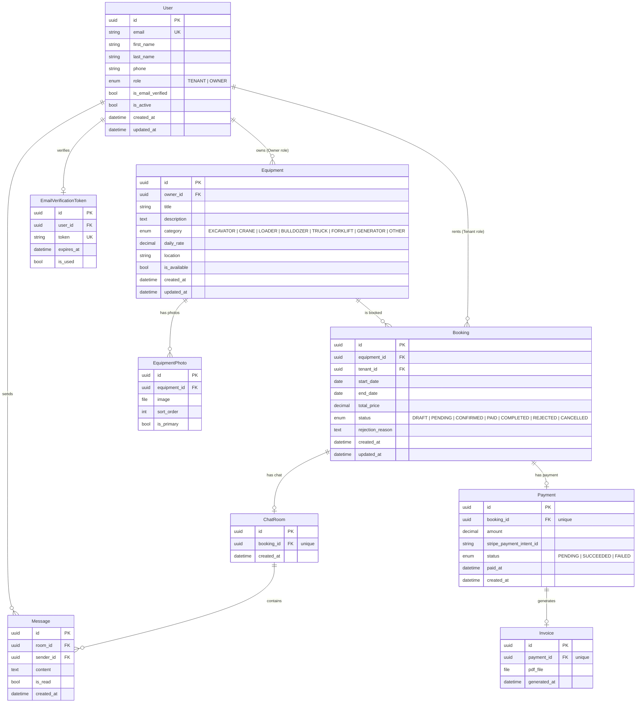
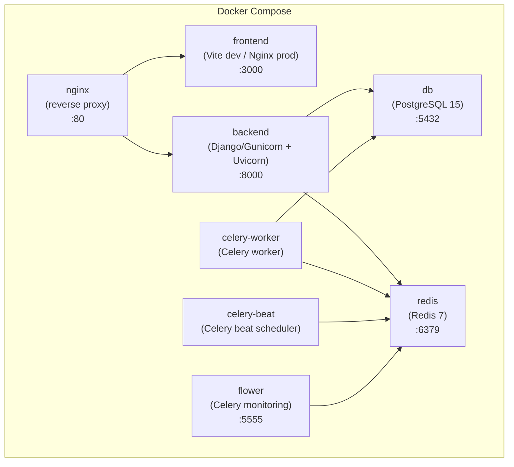

# HavyRentPro -- Full Architecture Plan

## 1. Problem Analysis

**What we are solving:** A portfolio-grade heavy equipment rental platform that demonstrates
full-stack proficiency -- JWT auth with RBAC, real-time chat, background task processing,
payment integration, and production-like infrastructure.

**Constraints:**
- Single developer, portfolio project -- must be impressive but realistic in scope
- Fixed tech stack (Django + DRF / React + TS / PostgreSQL / Redis / Celery / Channels)
- Two roles only: Tenant (rents equipment) and Owner (lists equipment)
- Stripe integration is mock-only (no real payment processing)
- Must run entirely via Docker Compose for reviewer convenience

**Key architectural drivers:**
- Clean separation of backend apps by domain (not by technical layer)
- Stateless backend (JWT) except for WebSocket connections
- All long-running work offloaded to Celery
- Redis serves double duty: Celery broker + cache (draft booking locks)

---

## 2. Repository Structure

```
HavyRentPro/
|-- backend/                          # Django project root
|   |-- config/                       # Django project settings package
|   |   |-- settings/
|   |   |   |-- base.py
|   |   |   |-- development.py
|   |   |   |-- test.py
|   |   |   |-- production.py
|   |   |-- urls.py
|   |   |-- asgi.py
|   |   |-- wsgi.py
|   |   |-- celery.py
|   |-- apps/
|   |   |-- accounts/                 # Auth & RBAC app
|   |   |-- equipment/                # Equipment catalog app
|   |   |-- bookings/                 # Booking lifecycle app
|   |   |-- chat/                     # WebSocket chat app
|   |   |-- payments/                 # Stripe mock & invoices app
|   |   |-- notifications/            # Email dispatch app
|   |   |-- core/                     # Shared utilities (base models, permissions, pagination)
|   |-- templates/                    # Email & PDF templates (Jinja2/Django templates)
|   |-- media/                        # User uploads (equipment photos) -- gitignored
|   |-- requirements/
|   |   |-- base.txt
|   |   |-- dev.txt
|   |   |-- test.txt
|   |-- manage.py
|   |-- pytest.ini
|   |-- conftest.py
|-- frontend/                         # React project root
|   |-- src/
|   |   |-- app/                      # Redux store, RTK Query base API, router
|   |   |-- features/                 # Feature-sliced modules
|   |   |   |-- auth/
|   |   |   |-- equipment/
|   |   |   |-- bookings/
|   |   |   |-- chat/
|   |   |   |-- dashboard/
|   |   |   |-- payments/
|   |   |-- shared/                   # Shared UI components, hooks, utils
|   |   |-- pages/                    # Route-level page components
|   |-- public/
|   |-- tailwind.config.ts
|   |-- tsconfig.json
|   |-- vite.config.ts
|   |-- package.json
|-- docker/
|   |-- backend/
|   |   |-- Dockerfile
|   |   |-- entrypoint.sh
|   |-- frontend/
|   |   |-- Dockerfile
|   |-- nginx/
|   |   |-- nginx.conf
|   |   |-- Dockerfile
|-- docker-compose.yml
|-- docker-compose.override.yml       # Dev overrides (volumes, hot reload)
|-- .github/
|   |-- workflows/
|       |-- ci.yml
|-- .env.example
|-- Makefile                           # Convenience commands (make up, make test, etc.)
```

---

## 3. Django App Structure

### 3.1 `core` -- Shared Foundation

**Responsibility:** Base classes, shared permissions, pagination, and utility mixins
used across all other apps. Has no models of its own (or only abstract base models).

**Contains:**
- `TimeStampedModel` -- abstract model with `created_at`, `updated_at`
- `IsOwnerPermission`, `IsTenantPermission` -- DRF permission classes
- `IsObjectOwnerPermission` -- object-level permission (owner of the resource)
- `StandardResultsSetPagination` -- project-wide pagination config
- Custom exception handler for DRF
- Shared enums / constants

### 3.2 `accounts` -- Auth & RBAC

**Responsibility:** Custom User model, registration, JWT token management,
email verification, role-based access.

**Contains:**
- Custom `User` model (extends `AbstractUser`)
- `UserRole` enum (TENANT, OWNER)
- Registration serializer with role selection
- Login / token refresh views (SimpleJWT)
- Email verification token model + view
- User profile serializer & view
- Signal: on user creation -> dispatch verification email task

### 3.3 `equipment` -- Equipment Catalog

**Responsibility:** Equipment CRUD (owner-only write), photo management,
search & filtering, availability checking.

**Contains:**
- `Equipment` model (title, description, category, daily_rate, location, owner FK)
- `EquipmentCategory` model (or choices enum -- keep it simple)
- `EquipmentPhoto` model (equipment FK, image file, ordering, is_primary flag)
- Search / filter viewset with date-range availability filtering
- Owner-only CRUD viewset for equipment management
- Photo upload endpoint (multi-file)

### 3.4 `bookings` -- Booking Lifecycle

**Responsibility:** Booking creation, status management, draft reservation via Redis,
occupancy calendar data.

**Contains:**
- `Booking` model (equipment FK, tenant FK, start_date, end_date, status, total_price)
- `BookingStatus` enum (DRAFT, PENDING, CONFIRMED, PAID, COMPLETED, REJECTED, CANCELLED)
- Draft booking service (Redis-backed 15-min lock)
- Booking create / update / cancel views
- Owner booking management views (confirm / reject)
- Occupancy calendar endpoint (returns booked date ranges for an equipment item)
- Signal: on booking status change -> notify via email task

### 3.5 `chat` -- Real-time Messaging

**Responsibility:** WebSocket chat rooms tied to bookings, message persistence,
typing indicators, read receipts.

**Contains:**
- `ChatRoom` model (booking FK, one-to-one)
- `Message` model (room FK, sender FK, content, timestamp, is_read)
- Channels consumer (WebSocket handler): connect, receive, disconnect
- Channels routing configuration
- REST endpoint to fetch message history (paginated)
- WebSocket events: `new_message`, `typing`, `read_receipt`

### 3.6 `payments` -- Stripe Mock & Invoices

**Responsibility:** Stripe mock payment intent creation, payment confirmation,
PDF invoice generation via Celery.

**Contains:**
- `Payment` model (booking FK, amount, stripe_payment_intent_id, status, paid_at)
- `Invoice` model (payment FK, file field for generated PDF, generated_at)
- Stripe mock service (simulates create_payment_intent, confirm_payment)
- Payment create / confirm views
- Invoice download endpoint
- Celery task: generate PDF invoice (WeasyPrint)
- Signal: on payment confirmed -> update booking status to PAID, trigger invoice task

### 3.7 `notifications` -- Email Dispatch

**Responsibility:** Celery tasks for sending emails. Decoupled from all other apps --
other apps dispatch tasks by name, this app owns the email rendering and sending logic.

**Contains:**
- Celery task: send verification email
- Celery task: send booking status change notification
- Celery task: send payment confirmation email
- Email template rendering utilities
- No models of its own

---

## 4. Data Model

### Entity Relationship Overview



### Key Design Decisions

- **UUIDs as primary keys** across all models -- prevents enumeration, looks professional
- **`User.role` is a single enum field**, not a groups/permissions system -- sufficient for
  two-role RBAC, avoids over-engineering
- **Booking has a `DRAFT` status** -- represents the 15-min Redis lock phase before
  the tenant commits to a booking request
- **ChatRoom is 1:1 with Booking** -- scoped conversations, no generic chat system
- **Payment is 1:1 with Booking** -- one payment per booking (no partial payments)
- **Soft delete is NOT used** -- portfolio project, keep it simple. Use `is_available`
  flag on Equipment instead

---

## 5. API Endpoint Map

All endpoints are prefixed with `/api/v1/`.

### 5.1 Accounts (`/api/v1/auth/`)

| Method | Endpoint                        | Description                    | Auth     | Role     |
|--------|---------------------------------|--------------------------------|----------|----------|
| POST   | `/auth/register/`               | Register new user              | Public   | --       |
| POST   | `/auth/login/`                  | Obtain JWT token pair          | Public   | --       |
| POST   | `/auth/token/refresh/`          | Refresh access token           | Public   | --       |
| POST   | `/auth/verify-email/`           | Verify email with token        | Public   | --       |
| GET    | `/auth/me/`                     | Get current user profile       | Required | Any      |
| PATCH  | `/auth/me/`                     | Update current user profile    | Required | Any      |

### 5.2 Equipment (`/api/v1/equipment/`)

| Method | Endpoint                              | Description                           | Auth     | Role     |
|--------|---------------------------------------|---------------------------------------|----------|----------|
| GET    | `/equipment/`                         | List/search equipment (with filters)  | Public   | --       |
| GET    | `/equipment/{id}/`                    | Equipment detail                      | Public   | --       |
| GET    | `/equipment/{id}/calendar/`           | Occupancy calendar (booked ranges)    | Public   | --       |
| POST   | `/equipment/`                         | Create equipment listing              | Required | Owner    |
| PATCH  | `/equipment/{id}/`                    | Update equipment                      | Required | Owner*   |
| DELETE | `/equipment/{id}/`                    | Delete equipment                      | Required | Owner*   |
| POST   | `/equipment/{id}/photos/`             | Upload photos                         | Required | Owner*   |
| DELETE | `/equipment/{id}/photos/{photo_id}/`  | Delete a photo                        | Required | Owner*   |

*Owner of the specific equipment item (object-level permission).

**Search query parameters:** `?category=`, `?location=`, `?min_price=`, `?max_price=`,
`?available_from=`, `?available_to=`, `?search=` (full-text on title/description)

### 5.3 Bookings (`/api/v1/bookings/`)

| Method | Endpoint                           | Description                        | Auth     | Role     |
|--------|------------------------------------|------------------------------------|----------|----------|
| POST   | `/bookings/draft/`                 | Create draft booking (Redis lock)  | Required | Tenant   |
| POST   | `/bookings/`                       | Confirm draft -> PENDING booking   | Required | Tenant   |
| GET    | `/bookings/`                       | List my bookings (tenant or owner) | Required | Any      |
| GET    | `/bookings/{id}/`                  | Booking detail                     | Required | Any*     |
| POST   | `/bookings/{id}/confirm/`          | Owner confirms booking             | Required | Owner*   |
| POST   | `/bookings/{id}/reject/`           | Owner rejects booking              | Required | Owner*   |
| POST   | `/bookings/{id}/complete/`         | Owner marks as completed           | Required | Owner*   |
| POST   | `/bookings/{id}/cancel/`           | Tenant cancels booking             | Required | Tenant*  |

*Participant in the specific booking (object-level permission).

### 5.4 Chat (`/api/v1/chat/` + WebSocket)

| Method    | Endpoint                          | Description                     | Auth     | Role     |
|-----------|-----------------------------------|---------------------------------|----------|----------|
| GET       | `/chat/rooms/`                    | List my chat rooms              | Required | Any      |
| GET       | `/chat/rooms/{id}/messages/`      | Message history (paginated)     | Required | Any*     |
| WebSocket | `ws/chat/{booking_id}/`           | Real-time chat connection       | JWT      | Any*     |

*Participant in the booking that owns the chat room.

**WebSocket message types (client -> server):**
- `chat.message` -- send a message
- `chat.typing` -- typing indicator
- `chat.read` -- mark messages as read

**WebSocket message types (server -> client):**
- `chat.message` -- new message received
- `chat.typing` -- other user is typing
- `chat.read` -- read receipt

### 5.5 Payments (`/api/v1/payments/`)

| Method | Endpoint                          | Description                      | Auth     | Role     |
|--------|-----------------------------------|----------------------------------|----------|----------|
| POST   | `/payments/`                      | Create payment intent (mock)     | Required | Tenant*  |
| POST   | `/payments/{id}/confirm/`         | Confirm payment (mock)           | Required | Tenant*  |
| GET    | `/payments/{id}/`                 | Payment detail                   | Required | Any*     |
| GET    | `/payments/{id}/invoice/`         | Download invoice PDF             | Required | Any*     |

*Participant in the associated booking.

### 5.6 Owner Dashboard (`/api/v1/dashboard/`)

| Method | Endpoint                          | Description                        | Auth     | Role     |
|--------|-----------------------------------|------------------------------------|----------|----------|
| GET    | `/dashboard/stats/`               | Income & idle stats summary        | Required | Owner    |
| GET    | `/dashboard/bookings/`            | Owner's booking requests (filtered)| Required | Owner    |
| GET    | `/dashboard/equipment/`           | Owner's equipment list             | Required | Owner    |

Note: Dashboard endpoints reuse data from `equipment` and `bookings` apps but provide
Owner-specific aggregations and views. These can be implemented as additional views inside
the `equipment` and `bookings` apps rather than a separate Django app -- there is no need
for a dedicated `dashboard` app on the backend.

---

## 6. Frontend Page & Component Structure

### 6.1 Pages (Route-level)

| Route                       | Page Component         | Auth   | Description                          |
|-----------------------------|------------------------|--------|--------------------------------------|
| `/`                         | `HomePage`             | Public | Landing with search bar              |
| `/login`                    | `LoginPage`            | Public | Login form                           |
| `/register`                 | `RegisterPage`         | Public | Registration with role selection     |
| `/verify-email/:token`      | `VerifyEmailPage`      | Public | Email verification handler           |
| `/equipment`                | `EquipmentListPage`    | Public | Search results with filters          |
| `/equipment/:id`            | `EquipmentDetailPage`  | Public | Detail + gallery + calendar          |
| `/bookings`                 | `BookingsListPage`     | Auth   | My bookings (Tenant or Owner view)   |
| `/bookings/:id`             | `BookingDetailPage`    | Auth   | Booking detail + chat + payment      |
| `/dashboard`                | `DashboardPage`        | Owner  | Owner dashboard (stats, equipment)   |
| `/dashboard/equipment/new`  | `EquipmentFormPage`    | Owner  | Create equipment                     |
| `/dashboard/equipment/:id`  | `EquipmentFormPage`    | Owner  | Edit equipment                       |

### 6.2 Feature Module Structure (per feature)

Each feature folder follows this structure:
```
features/{feature}/
|-- api.ts              # RTK Query endpoint definitions
|-- types.ts            # TypeScript interfaces for the domain
|-- components/         # Feature-specific UI components
|-- hooks/              # Feature-specific custom hooks
|-- slices/             # Redux slices (if local state needed beyond RTK Query cache)
```

### 6.3 Key Shared Components

| Component               | Description                                        |
|--------------------------|----------------------------------------------------|
| `ProtectedRoute`         | Route guard, redirects to login if unauthenticated |
| `RoleGuard`              | Renders children only if user has required role    |
| `Navbar`                 | Top navigation with auth state awareness           |
| `SearchBar`              | Equipment search with debounce (used on Home too)  |
| `FilterSidebar`          | Category, price range, date range filters          |
| `PhotoGallery`           | Lightbox-style image gallery                       |
| `OccupancyCalendar`      | Calendar showing booked/available dates            |
| `DragDropUpload`         | Multi-file drag-and-drop photo uploader            |
| `StatusBadge`            | Colored badge for booking/payment status           |
| `ChatWindow`             | WebSocket chat UI with typing/read indicators      |
| `StatsChart`             | Dashboard charts (income, idle time)               |
| `Pagination`             | Shared pagination component                        |
| `EmptyState`             | Placeholder for empty lists                        |
| `LoadingSpinner`         | Consistent loading indicator                       |
| `ConfirmDialog`          | Reusable confirmation modal                        |

### 6.4 State Management Strategy

- **Server state**: RTK Query handles all API data caching, invalidation, and loading states
- **Auth state**: Redux slice (`authSlice`) stores JWT tokens + user info, persisted to localStorage
- **WebSocket state**: Managed locally in `ChatWindow` via `useRef` + `useState` (not Redux)
- **Form state**: React Hook Form for all forms
- **URL state**: React Router search params for search/filter state (shareable URLs)

---

## 7. Docker Compose Service Topology



### Service Details

| Service        | Image / Build               | Ports      | Depends On        | Notes                                           |
|----------------|-----------------------------|------------|-------------------|--------------------------------------------------|
| `db`           | `postgres:15-alpine`        | 5432       | --                | Volume: `postgres_data`                          |
| `redis`        | `redis:7-alpine`            | 6379       | --                | Used as Celery broker + cache                    |
| `backend`      | Build from `docker/backend` | 8000       | db, redis         | Runs Daphne (ASGI) for HTTP + WebSocket          |
| `celery-worker`| Same image as backend       | --         | db, redis         | Command override: `celery -A config worker`      |
| `celery-beat`  | Same image as backend       | --         | redis             | Command override: `celery -A config beat`        |
| `flower`       | Same image as backend       | 5555       | redis             | Command override: `celery -A config flower`      |
| `frontend`     | Build from `docker/frontend`| 3000       | --                | Dev: Vite dev server. Prod: Nginx serving build  |
| `nginx`        | Build from `docker/nginx`   | 80         | backend, frontend | Routes `/api/` and `/ws/` to backend, rest to FE |

### Nginx Routing Rules

- `/api/*` and `/admin/*` -> proxy to `backend:8000`
- `/ws/*` -> proxy to `backend:8000` (WebSocket upgrade)
- `/media/*` -> serve from shared volume (equipment photos)
- `/*` -> proxy to `frontend:3000`

### Backend ASGI Server Note

Use **Daphne** (or **Uvicorn with `--workers`**) as the ASGI server since the project
uses Django Channels for WebSocket support. Standard Gunicorn with sync workers cannot
handle WebSocket connections. The single ASGI server handles both HTTP and WebSocket
protocols.

---

## 8. GitHub Actions CI Pipeline

```yaml
# .github/workflows/ci.yml -- Structure (not actual YAML)

name: CI

on:
  push:
    branches: [master, develop]
  pull_request:
    branches: [master]

jobs:

  backend-lint:
    # Runs: ruff check + ruff format --check
    # Python 3.11, no services needed

  backend-test:
    # Services: PostgreSQL 15, Redis 7
    # Steps:
    #   1. Checkout
    #   2. Setup Python 3.11
    #   3. Install dependencies (requirements/test.txt)
    #   4. Run pytest with coverage
    #   5. Upload coverage report as artifact
    # Env vars: DATABASE_URL, REDIS_URL, DJANGO_SETTINGS_MODULE=config.settings.test

  frontend-lint:
    # Runs: eslint + tsc --noEmit (type check)
    # Node 20, no services needed

  frontend-test:
    # Runs: vitest (unit tests for components, hooks, utils)
    # Node 20, no services needed

  frontend-build:
    # Runs: vite build (ensures production build works)
    # Node 20, no services needed
```

### CI Pipeline Key Points

- Backend tests run against real PostgreSQL and Redis (GitHub Actions services)
- `pytest-django` for all Django/DRF tests
- `pytest-asyncio` + `channels[tests]` for WebSocket consumer tests
- Coverage threshold enforced (suggest 80% minimum)
- Frontend and backend jobs run in parallel (no dependency)
- No deployment step -- portfolio project, manual deploy or separate workflow

---

## 9. Implementation Checklist

This is the step-by-step guide. Each step is atomic and can be committed independently.

### Phase 0: Project Scaffolding

- [ ] **0.1** Create the Django project with `django-admin startproject config backend`
- [ ] **0.2** Reorganize settings into `config/settings/base.py`, `development.py`, `test.py`, `production.py`
- [ ] **0.3** Create `requirements/base.txt`, `dev.txt`, `test.txt` with all dependencies
- [ ] **0.4** Create all Django apps under `backend/apps/`: `core`, `accounts`, `equipment`, `bookings`, `chat`, `payments`, `notifications`
- [ ] **0.5** Configure `INSTALLED_APPS`, database (PostgreSQL), Redis cache, static/media settings in `base.py`
- [ ] **0.6** Create the React project with Vite + TypeScript template inside `frontend/`
- [ ] **0.7** Install and configure Tailwind CSS, React Router, Redux Toolkit, RTK Query
- [ ] **0.8** Create `docker/backend/Dockerfile` and `docker/backend/entrypoint.sh`
- [ ] **0.9** Create `docker/frontend/Dockerfile`
- [ ] **0.10** Create `docker/nginx/Dockerfile` and `docker/nginx/nginx.conf`
- [ ] **0.11** Create `docker-compose.yml` with all 8 services
- [ ] **0.12** Create `docker-compose.override.yml` for dev (volumes, hot reload)
- [ ] **0.13** Create `.env.example` with all required environment variables
- [ ] **0.14** Create `Makefile` with convenience commands (`up`, `down`, `test`, `migrate`, `shell`)
- [ ] **0.15** Create `.github/workflows/ci.yml` with all 5 jobs (can be stubs initially)
- [ ] **0.16** Verify `docker-compose up` starts all services without errors

### Phase 1: Core & Auth

- [ ] **1.1** Implement `TimeStampedModel` abstract base model in `core`
- [ ] **1.2** Implement custom `User` model in `accounts` with `role` field, UUID pk
- [ ] **1.3** Create and run initial migration for `accounts`
- [ ] **1.4** Configure SimpleJWT in settings (token lifetimes, claims)
- [ ] **1.5** Implement registration endpoint (with role selection)
- [ ] **1.6** Implement login (token obtain pair) and token refresh endpoints
- [ ] **1.7** Implement `EmailVerificationToken` model and migration
- [ ] **1.8** Implement email verification endpoint
- [ ] **1.9** Implement user profile (GET/PATCH `/auth/me/`) endpoint
- [ ] **1.10** Configure Celery in `config/celery.py` and wire into Django
- [ ] **1.11** Implement `send_verification_email` Celery task in `notifications`
- [ ] **1.12** Wire user registration signal to dispatch verification email task
- [ ] **1.13** Implement `IsOwnerPermission`, `IsTenantPermission` in `core`
- [ ] **1.14** Create frontend `authSlice` with token storage in localStorage
- [ ] **1.15** Create RTK Query auth API endpoints
- [ ] **1.16** Build `LoginPage` and `RegisterPage` (with role selection radio)
- [ ] **1.17** Build `VerifyEmailPage`
- [ ] **1.18** Build `Navbar` with auth-aware state (login/logout/user info)
- [ ] **1.19** Build `ProtectedRoute` and `RoleGuard` components
- [ ] **1.20** Write backend tests for auth endpoints (registration, login, verify, profile)
- [ ] **1.21** Write frontend tests for auth flow (login form, token storage)

### Phase 2: Equipment Catalog

- [ ] **2.1** Implement `Equipment` model with UUID pk, owner FK, all fields
- [ ] **2.2** Implement `EquipmentPhoto` model with sort_order and is_primary
- [ ] **2.3** Create and run migrations for equipment models
- [ ] **2.4** Implement public equipment list endpoint with search & filters (Q objects, `django-filter`)
- [ ] **2.5** Implement public equipment detail endpoint (with nested photos)
- [ ] **2.6** Implement owner-only equipment CRUD viewset (create, update, delete)
- [ ] **2.7** Implement photo upload endpoint (multi-file)
- [ ] **2.8** Implement photo delete endpoint
- [ ] **2.9** Create RTK Query equipment API endpoints
- [ ] **2.10** Build `EquipmentListPage` with `SearchBar` and `FilterSidebar`
- [ ] **2.11** Implement debounced search input (300ms debounce)
- [ ] **2.12** Build `EquipmentDetailPage` with `PhotoGallery`
- [ ] **2.13** Write backend tests for equipment CRUD + search/filter endpoints
- [ ] **2.14** Write frontend tests for equipment list and search components

### Phase 3: Bookings & Calendar

- [ ] **3.1** Implement `Booking` model with status enum, UUID pk
- [ ] **3.2** Create and run booking migration
- [ ] **3.3** Implement draft booking service (Redis SET with 15-min TTL)
- [ ] **3.4** Implement draft booking endpoint (creates Redis lock, returns draft info)
- [ ] **3.5** Implement booking creation endpoint (converts draft to PENDING)
- [ ] **3.6** Implement date-range availability filtering on equipment list (exclude booked items using date range intersection query)
- [ ] **3.7** Implement occupancy calendar endpoint (`/equipment/{id}/calendar/`)
- [ ] **3.8** Implement booking list endpoint (tenant sees own bookings, owner sees bookings for their equipment)
- [ ] **3.9** Implement booking detail endpoint
- [ ] **3.10** Implement booking action endpoints (confirm, reject, complete, cancel) with status transition validation
- [ ] **3.11** Implement `send_booking_notification` Celery task in `notifications`
- [ ] **3.12** Wire booking status change signal to notification task
- [ ] **3.13** Build `OccupancyCalendar` component
- [ ] **3.14** Integrate calendar into `EquipmentDetailPage` with "Book Now" flow
- [ ] **3.15** Build `BookingsListPage` with status filter tabs
- [ ] **3.16** Build `BookingDetailPage` with status-aware action buttons
- [ ] **3.17** Write backend tests for booking lifecycle (create, status transitions, permissions)
- [ ] **3.18** Write backend tests for draft booking Redis lock (creation, expiration, conflict)
- [ ] **3.19** Write backend tests for date-range availability filtering

### Phase 4: Owner Dashboard

- [ ] **4.1** Implement dashboard stats endpoint (total income, active listings, idle equipment count, booking counts by status)
- [ ] **4.2** Implement owner's booking request list endpoint with status filtering
- [ ] **4.3** Build `DashboardPage` layout with stats cards and sections
- [ ] **4.4** Build `StatsChart` component (income over time, idle days per equipment)
- [ ] **4.5** Build equipment management section (list + create/edit flow)
- [ ] **4.6** Build `EquipmentFormPage` with `DragDropUpload` for photos
- [ ] **4.7** Build booking request management section (approve/reject actions)
- [ ] **4.8** Write backend tests for dashboard stats aggregation
- [ ] **4.9** Write frontend tests for dashboard components

### Phase 5: Chat (WebSocket)

- [ ] **5.1** Install and configure Django Channels with Redis channel layer
- [ ] **5.2** Configure ASGI application in `config/asgi.py` with Channels routing
- [ ] **5.3** Implement `ChatRoom` and `Message` models
- [ ] **5.4** Create and run chat migrations
- [ ] **5.5** Implement Channels WebSocket consumer (connect with JWT auth, receive, disconnect)
- [ ] **5.6** Implement `chat.message` handler (persist message, broadcast to room)
- [ ] **5.7** Implement `chat.typing` handler (broadcast typing indicator, no persistence)
- [ ] **5.8** Implement `chat.read` handler (mark messages as read, broadcast receipt)
- [ ] **5.9** Implement message history REST endpoint (paginated)
- [ ] **5.10** Implement chat room list REST endpoint
- [ ] **5.11** Auto-create ChatRoom when booking reaches CONFIRMED status
- [ ] **5.12** Build `ChatWindow` component with WebSocket connection management
- [ ] **5.13** Implement typing indicator UI ("User is typing...")
- [ ] **5.14** Implement read receipt UI (checkmarks on messages)
- [ ] **5.15** Integrate `ChatWindow` into `BookingDetailPage`
- [ ] **5.16** Write backend tests for WebSocket consumer (connect, message, typing, read, auth rejection)
- [ ] **5.17** Write backend tests for message history endpoint

### Phase 6: Payments & Invoices

- [ ] **6.1** Implement `Payment` model with UUID pk and status enum
- [ ] **6.2** Implement `Invoice` model with file field
- [ ] **6.3** Create and run payment migrations
- [ ] **6.4** Implement Stripe mock service (create_payment_intent returns fake ID, confirm returns success)
- [ ] **6.5** Implement payment creation endpoint (creates Payment + mock intent)
- [ ] **6.6** Implement payment confirmation endpoint (updates Payment status, triggers booking status to PAID)
- [ ] **6.7** Implement PDF invoice template (HTML for WeasyPrint)
- [ ] **6.8** Implement `generate_invoice` Celery task (render HTML -> PDF, save to Invoice)
- [ ] **6.9** Implement `send_payment_confirmation` Celery task
- [ ] **6.10** Wire payment confirmation to invoice generation + email tasks
- [ ] **6.11** Implement invoice download endpoint
- [ ] **6.12** Build payment flow UI in `BookingDetailPage` (pay button, confirmation)
- [ ] **6.13** Build invoice download button in `BookingDetailPage`
- [ ] **6.14** Write backend tests for payment flow (create, confirm, status transitions)
- [ ] **6.15** Write backend tests for invoice generation Celery task
- [ ] **6.16** Write frontend tests for payment UI flow

### Phase 7: Polish & Production Readiness

- [ ] **7.1** Add `StandardResultsSetPagination` across all list endpoints
- [ ] **7.2** Add custom DRF exception handler with consistent error format
- [ ] **7.3** Add request throttling (DRF throttle classes)
- [ ] **7.4** Add CORS configuration for frontend origin
- [ ] **7.5** Add Django admin registrations for all models
- [ ] **7.6** Add logging configuration (structured JSON logging)
- [ ] **7.7** Add health check endpoint (`/api/v1/health/`)
- [ ] **7.8** Finalize CI pipeline (ensure all tests pass, coverage threshold)
- [ ] **7.9** Create production Dockerfile optimizations (multi-stage build)
- [ ] **7.10** Write comprehensive README.md with setup instructions, architecture overview, screenshots placeholder
- [ ] **7.11** Final review: run full test suite, verify Docker Compose up, test all features manually

---

## 10. Test Architecture

### 10.1 Testing Stack

- **Backend:** `pytest` + `pytest-django` + `pytest-asyncio` + `factory-boy` + `channels[tests]`
- **Frontend:** `vitest` + `@testing-library/react` + `msw` (Mock Service Worker)
- **CI:** GitHub Actions runs both suites against real PostgreSQL + Redis

### 10.2 Backend Test Directory Structure

```
backend/
|-- conftest.py                    # Shared fixtures: api_client, authenticated_client,
|                                  #   owner_user, tenant_user, equipment_factory, etc.
|-- apps/
|   |-- accounts/
|   |   |-- tests/
|   |       |-- test_models.py
|   |       |-- test_views.py
|   |       |-- test_serializers.py
|   |-- equipment/
|   |   |-- tests/
|   |       |-- test_models.py
|   |       |-- test_views.py
|   |       |-- test_filters.py
|   |-- bookings/
|   |   |-- tests/
|   |       |-- test_models.py
|   |       |-- test_views.py
|   |       |-- test_services.py    # Draft booking Redis service
|   |-- chat/
|   |   |-- tests/
|   |       |-- test_models.py
|   |       |-- test_consumers.py   # WebSocket consumer tests
|   |       |-- test_views.py
|   |-- payments/
|   |   |-- tests/
|   |       |-- test_models.py
|   |       |-- test_views.py
|   |       |-- test_services.py    # Stripe mock service
|   |       |-- test_tasks.py       # Invoice generation task
|   |-- notifications/
|   |   |-- tests/
|   |       |-- test_tasks.py       # Email dispatch tasks
```

### 10.3 What to Test Per Module

#### Accounts (Auth & RBAC)

**Unit tests:**
- User model: creating a user with each role, email uniqueness, `is_email_verified` default
- Registration serializer: valid data, missing fields, duplicate email, invalid role
- EmailVerificationToken model: token generation, expiry check

**Integration tests (DRF views):**
- Registration: returns 201, creates user, dispatches verification email task (mock Celery)
- Login: returns token pair for valid credentials, 401 for invalid
- Token refresh: returns new access token for valid refresh token, 401 for expired
- Email verification: returns 200 for valid token, 400 for expired/used token
- Profile GET: returns user data, 401 for unauthenticated
- Profile PATCH: updates allowed fields, ignores role change attempts
- Permission enforcement: Owner-only endpoints reject Tenant, and vice versa

**Celery task tests:**
- `send_verification_email`: calls `send_mail` with correct arguments (mock SMTP)

#### Equipment

**Unit tests:**
- Equipment model: string representation, `daily_rate` validation (positive decimal)
- EquipmentPhoto model: sort ordering, `is_primary` constraint
- Filter logic: date range intersection query correctly excludes booked equipment

**Integration tests (DRF views):**
- List: returns paginated results, respects search query, category filter, price range filter
- List with date filter: excludes equipment with overlapping bookings
- Detail: returns equipment with nested photos
- Create (Owner): returns 201, associates with owner
- Create (Tenant): returns 403
- Update: only equipment owner can update, 403 for other owners
- Delete: only equipment owner can delete
- Photo upload: accepts multiple files, creates EquipmentPhoto records
- Photo delete: only equipment owner can delete photos

#### Bookings

**Unit tests:**
- Booking model: `total_price` calculation (daily_rate * days), status transitions validation
- Status enum: valid transition paths (DRAFT->PENDING->CONFIRMED->PAID->COMPLETED, etc.)
- Draft service: Redis key format, TTL is set to 15 minutes

**Integration tests (DRF views):**
- Draft creation: returns draft info, sets Redis key, 409 if equipment already locked
- Draft expiry: after 15 min TTL, equipment can be booked again
- Booking creation: converts valid draft to PENDING, 400 if draft expired
- Booking creation: rejects overlapping date ranges for same equipment
- Confirm (Owner): transitions to CONFIRMED, 403 for tenant
- Reject (Owner): transitions to REJECTED, requires rejection_reason
- Cancel (Tenant): only allowed before CONFIRMED status
- Complete (Owner): only allowed from PAID status
- List: Tenant sees own bookings, Owner sees bookings for their equipment
- Booking detail: only participants (tenant or equipment owner) can view
- Calendar: returns correct booked date ranges for given equipment

**Celery task tests:**
- `send_booking_notification`: called on status change with correct booking data

#### Chat (WebSocket)

**Unit tests:**
- Message model: `is_read` defaults to False, ordering by `created_at`
- ChatRoom model: one-to-one with booking

**WebSocket consumer tests (using `channels.testing.WebsocketCommunicator`):**
- Connect: authenticated user who is a booking participant can connect
- Connect: unauthenticated request is rejected
- Connect: user who is not a booking participant is rejected
- Send message: message is persisted to database and broadcast to room
- Typing indicator: typing event is broadcast but NOT persisted
- Read receipt: messages are marked as read in database and receipt is broadcast
- Disconnect: clean disconnect, no errors

**Integration tests (REST views):**
- Message history: returns paginated messages, only accessible by room participants
- Chat room list: returns rooms where user is a participant

#### Payments

**Unit tests:**
- Payment model: status transitions (PENDING->SUCCEEDED, PENDING->FAILED)
- Stripe mock service: `create_payment_intent` returns a dict with expected shape, `confirm_payment` returns success
- Invoice model: `generated_at` is set on creation

**Integration tests (DRF views):**
- Create payment: creates Payment record + mock intent, 400 if booking not CONFIRMED
- Confirm payment: updates Payment to SUCCEEDED, transitions Booking to PAID
- Confirm payment: triggers invoice generation task (mock Celery)
- Payment detail: only booking participants can view
- Invoice download: returns PDF file, 404 if not yet generated
- Invoice download: only booking participants can access

**Celery task tests:**
- `generate_invoice`: produces a valid PDF file, saves to Invoice record
- `generate_invoice`: PDF contains correct booking/payment details (mock WeasyPrint or use real rendering in test)
- `send_payment_confirmation`: calls `send_mail` with correct arguments

#### Notifications

**Celery task tests:**
- All email tasks: verify `send_mail` is called with expected subject, recipient, body content
- All email tasks: handle missing/invalid user email gracefully (no crash)
- Task retry behavior: tasks retry on transient SMTP errors (if implemented)

### 10.4 Frontend Test Coverage

**Unit tests (vitest + testing-library):**
- Auth: `LoginPage` form validation, `RegisterPage` role selection, token persistence in localStorage
- Equipment: `SearchBar` debounce behavior, `FilterSidebar` filter state, `PhotoGallery` navigation
- Bookings: `OccupancyCalendar` displays booked dates correctly, `StatusBadge` renders correct colors
- Dashboard: `StatsChart` renders with mock data, `DragDropUpload` file handling
- Chat: `ChatWindow` renders message list, handles typing indicator display
- Shared: `ProtectedRoute` redirects unauthenticated users, `RoleGuard` hides/shows content

**Integration tests (msw for API mocking):**
- Auth flow: register -> verify -> login -> access protected page
- Equipment search: type query -> debounce -> API call -> results rendered
- Booking flow: select dates -> draft -> confirm -> payment
- RTK Query cache invalidation: after booking creation, equipment list refetches

### 10.5 CI Test Pipeline Checklist

The CI pipeline (`ci.yml`) should execute these test stages:

**Backend lint job:**
- `ruff check backend/` -- linting rules
- `ruff format --check backend/` -- formatting check

**Backend test job (requires PostgreSQL + Redis services):**
- `pytest --cov=apps --cov-report=xml --cov-fail-under=80` -- run all tests with coverage
- Upload coverage XML as artifact
- Test environment: `DJANGO_SETTINGS_MODULE=config.settings.test`

**Frontend lint job:**
- `npx eslint src/` -- linting
- `npx tsc --noEmit` -- type checking

**Frontend test job:**
- `npx vitest run --coverage` -- run all tests with coverage

**Frontend build job:**
- `npx vite build` -- verify production build compiles

### 10.6 Test Fixtures & Factories (backend)

Define these in `conftest.py` using `factory-boy`:
- `UserFactory` -- creates User with configurable role (default: TENANT)
- `EquipmentFactory` -- creates Equipment with auto-created Owner user
- `EquipmentPhotoFactory` -- creates photo for equipment
- `BookingFactory` -- creates Booking with auto-created equipment and tenant
- `ChatRoomFactory` -- creates ChatRoom with auto-created booking
- `MessageFactory` -- creates Message in a chat room
- `PaymentFactory` -- creates Payment for a booking

Define these as pytest fixtures:
- `api_client` -- DRF `APIClient` instance
- `tenant_user` -- User with TENANT role
- `owner_user` -- User with OWNER role
- `authenticated_client(user)` -- `APIClient` with JWT auth header set for given user
- `sample_equipment` -- Equipment instance owned by `owner_user`
- `sample_booking` -- Booking for `sample_equipment` by `tenant_user`

---

## 11. Architectural Decision Records

### ADR-1: Monorepo with Separate Backend/Frontend Directories

**Decision:** Keep backend and frontend in a single repository with top-level `backend/` and `frontend/` directories.

**Rationale:** Portfolio project worked on by a single developer. A monorepo simplifies version control, Docker Compose configuration, and CI pipeline. No need for the operational overhead of separate repos.

### ADR-2: UUID Primary Keys

**Decision:** Use UUID v4 as primary keys for all domain models.

**Rationale:** Prevents ID enumeration in API URLs (security), avoids integer overflow concerns, and looks more professional in a portfolio project. The performance cost is negligible at portfolio scale.

### ADR-3: Single User Model with Role Enum (not Django Groups)

**Decision:** Store the user role as a single `role` CharField with choices, not using Django's built-in Groups/Permissions system.

**Rationale:** Two roles (Tenant, Owner) are too simple to justify the complexity of Django's permission framework. A role field with custom DRF permission classes is explicit, easy to understand, and easy to test.

### ADR-4: Daphne as ASGI Server (not Gunicorn)

**Decision:** Use Daphne (or Uvicorn) as the application server, not Gunicorn.

**Rationale:** Django Channels requires an ASGI server to handle WebSocket connections. Gunicorn with sync workers cannot handle WebSocket upgrades. Daphne is the reference ASGI server for Django Channels and handles both HTTP and WebSocket protocols.

### ADR-5: Redis for Draft Booking Locks (not Database)

**Decision:** Use Redis SET with TTL for the 15-minute draft booking reservation, not a database record.

**Rationale:** The draft lock is ephemeral by nature -- it must auto-expire after 15 minutes. Redis TTL handles this natively without requiring a cleanup job. The lock is a cache concern, not a data persistence concern.

### ADR-6: Stripe Mock as a Service Class (not a Separate App)

**Decision:** Implement the Stripe mock as a service class inside the `payments` app, not as a separate reusable package.

**Rationale:** This is a portfolio project with no real payment processing. The mock service is a simple class that returns fake data. Extracting it into a separate package would be over-engineering. It can be swapped for real Stripe SDK calls by changing the service implementation (Strategy pattern).

### ADR-7: No Separate Dashboard Django App

**Decision:** Dashboard API endpoints are implemented as additional views within `equipment` and `bookings` apps, not in a dedicated `dashboard` app.

**Rationale:** The dashboard is a read-only aggregation view over existing data. Creating a separate app would introduce cross-app imports and unclear ownership. The aggregation queries belong near the models they query.

---

*Plan created: 2026-03-17*
*Covers: Full system architecture for HavyRentPro portfolio project*
